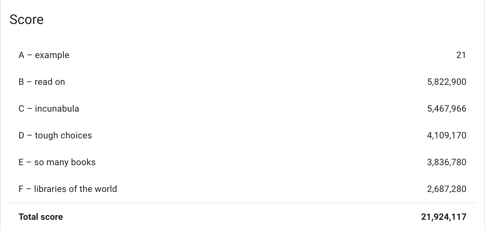

[](#contributors-)
<p align="center">
  <a href="https://www.linkedin.com/in/hezzahir/">
    
  </a>
</p>
<h1 align="center">
  HashCode 2020 Solution
</h1>

# About 

This solution will get around 21,924,117 points (21,924,117 in the competition; #3671 place Worldwide / #17 in Morocco 🇲🇦)

# Score 



## 🏆 Problem : Book scanning 

1.  **The problem statement is**
```
As Google did to fill up its Google Books database, we had to find the best process
 to scan books (with a score S) from a number of libraries (L) given some constraints 
and to get the highest score (the sum of the scores of all books that are scanned within D days).

Each library has a number of books (B), a number of books that can be scanned
 each day (M) and a sign up time for scanning (T).
Libraries can only have one copy of a book but many libraries can have a 
copy of the same book. When multiple copies of the same books are scanned, 
their score are only counted once. Only one library can sign up at a time.

Given six different input datasets of different sizes, we had to provide 
for each one of them an ordered list of libraries to sign up along the ordered
list of their books to scan.
```

   More infos, You can find the problem statement **[here](./hashcode_2020_online_qualification_round.pdf)**.

2.  **Solution**

    Our **[solution.cpp](./solution.cpp)** was an greedy approch, but i would love to share one of most optimzed solutions that i find it 
   
      here : **[dev.to](https://dev.to/hjonin/our-experience-at-google-hashcode-2020-2j0p)**
    

# 🛡Our Team "End Game"

* Hamza Ezzahiry [@SpiderX](https://www.linkedin.com/in/hezzahir)
* Mhamed Kchikech [@mkchikch](https://www.linkedin.com/in/mhamed-kchikech-a05153146)
* Ayoub Moussaid [@RainMan](https://www.linkedin.com/in/ayoub-moussaid/)
* Gourragui Abderrahman [@Smigy](https://www.linkedin.com/in/abdel-gourragui-4169b2107/) 

from  **[1337 Coding School](https://www.1337.ma)**

 
